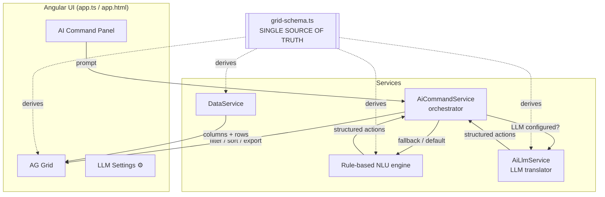
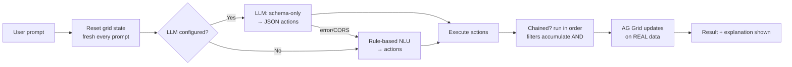
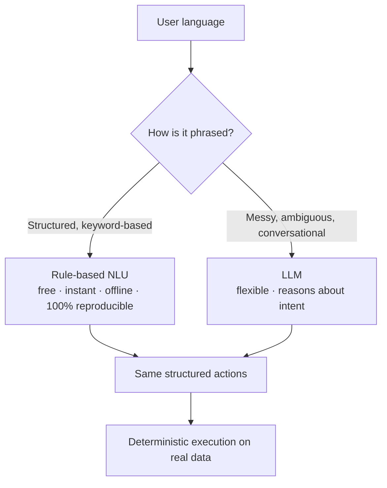
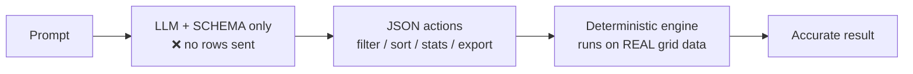
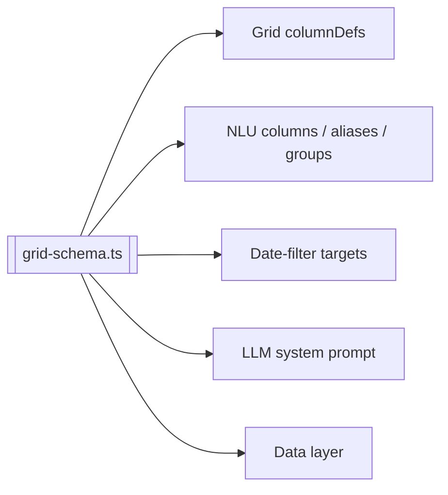

# AG Grid AI — Natural-Language Data Grid

An Angular + AG Grid application that lets users **control and analyze a data grid using plain English**. Type a request like *"show only Vignesh's rows from June, newest first, then export"* and the app filters, sorts, and exports — no clicks, no filter menus.

It ships with **two interchangeable understanding engines**:

- a fast, free, deterministic **rule-based NLU engine**, and
- an optional, more flexible **LLM engine** (OpenAI / Gemini / Grok / Groq / Ollama).

Both convert language into the **same structured actions**, which the app executes on the real data.

---

## 1. What the project does

| Capability | Example phrase |
|---|---|
| **Filter** (text, number, date, ranges, AND/OR) | `filter user contains vignesh and number > 5` |
| **Sort** | `sort by submitted date desc` |
| **Date windows** | `target date range start between june 8 to june 11 2026` |
| **Stats / analytics** | `who submitted the most?`, `average number` |
| **Column visibility** | `hide comments and submitted date` |
| **Pagination / row subsets** | `show last 10 rows`, `20 per page` |
| **Export / mail** | `export csv`, `send to me@example.com` |
| **Chained workflows** | `keep priya and oscar, newest first, then export` |

---

## 2. High-level architecture



**Everything is driven by one schema file** — [`grid-schema.ts`](src/app/services/grid-schema.ts). Columns, NLU aliases, date logic, the grid definition, and the LLM prompt are all generated from it. Add a column there once and every layer updates.

---

## 3. Request workflow



Key behaviors:

- **Fresh per prompt** — filters reset before each new prompt; chain multiple steps in one prompt to combine them.
- **LLM-first with automatic fallback** — if the LLM errors (bad key, CORS, offline), the deterministic engine runs instead.
- **Actions run in order**; export/mail always run **last** on the final view.

---

## 4. Why we have BOTH an NLU engine and an LLM

They solve different problems. The app uses the LLM when configured and **falls back** to the rule engine automatically.



| | Rule-based NLU | LLM |
|---|---|---|
| Cost | Free | Free→paid (provider) |
| Speed | Instant | Network latency |
| Works offline | ✅ | Only Ollama (local) |
| Reproducible | ✅ 100% | ✗ probabilistic |
| Typos / loose grammar | ✗ | ✅ |
| Synonyms outside alias list | ✗ | ✅ |
| Reasoning about intent | ✗ | ✅ |
| Data privacy | ✅ nothing leaves app | Schema only (no rows) |

---

## 5. The LLM is a **translator**, not a data reader

> **The LLM never receives your data.** It only gets the **column schema** and turns language into structured actions. The app executes those actions on the real rows, so all counts and values are computed by **code** — never guessed by the model.



**Why this matters:**
- **Accuracy** — the model can't hallucinate numbers; it says *"compute the average"* and the app returns the real value.
- **Scale** — payload stays tiny whether you have 30 rows or 30 million.
- **Privacy** — sensitive rows never leave the browser.
- **API-ready** — the same structured-query pattern maps directly onto a backend (server-side filtering/sorting) later.

---

## 6. Sample prompts

### Rule-based NLU (keyword-driven — free, offline)
```
filter user contains vignesh and number > 5
sort by submitted date desc
filter target date range start between june 8 to june 11 2026
filter number at least 2 but no more than 9 and not equal to 5
filter comments contains Q2 or check or schema
show last 10 rows
distribution by user
hide comments and submitted date
export csv
filter user contains vignesh; sort by date desc; export
```

### LLM (tolerates messy, human language)
```
filtr the peple whos naem has vignsh and sohw newest frist
who are the busiest contributors this quarter?
I only care about Priya's recent work, hide everything else
which submissions might be risky or incomplete?
clean this up — just vignesh and sowmiya, newest first, only id number and user, then export it
give me a handful of the earliest entries
summarize workload distribution across the team
```

### Chained workflows (both engines, best in one prompt)
```
keep only priya and oscar, hide comments and submitted date, sort by end date asc, then download as csv
target date range start between june 5 and june 30 2026, user is vignesh or priya, comments contain Q2 or check, show 5 per page
filter number >= 2 and number <= 9 and number != 5, then sort by number descending
```

---

## 7. How the LLM is better than the NLU

The engines are equally accurate at **execution** (same deterministic code). The LLM wins on **understanding**:

1. **Typos & broken grammar** — `filtr peple whos naem has vignsh` → still maps correctly.
2. **Synonyms not coded as aliases** — *"busiest contributors"* → distribution by user.
3. **Indirect intent** — *"I only care about Priya's recent work"* → filter + sort.
4. **Reasoning** — *"risky or incomplete submissions"* → filter comments is empty.
5. **Decomposition** — one messy sentence → many ordered actions.
6. **Fuzzy quantities** — *"a handful of the earliest"* → show first 5.

**What the LLM does *not* do (by design):**
- It never knows your data values — it triggers a `stats`/`filter` action; the app computes the truth.
- It isn't 100% reproducible — for guaranteed determinism the rule engine is the fallback.
- It can't invent columns — it's constrained to the schema.

**Rule of thumb:** structured/repeatable commands → NLU is enough; messy/human/ambiguous language → the LLM earns its keep.

---

## 8. Multi-condition & chaining details

- **Chaining**: input is split on `;`, `then`, `. `, `, `, and `and/with <verb>`; segments run in order; **filters accumulate (AND)** across the chain.
- **Many conditions on ONE column** (up to 20): applied as a **single** AG Grid filter model — not one-by-one.
  - OR values (`a or b or c`) → one **OR** group.
  - Comparisons (`>=2`, `<=9`, `!=5`) → **AND** together.
- **Dates** are parsed from natural language (`june 8`, `june 30th 2026`, `06/05/2026`) and applied via an external filter (works on text-stored dates).

---

## 9. Schema-driven design (single source of truth)

[`grid-schema.ts`](src/app/services/grid-schema.ts) defines each column once:

```ts
{ id: 'submittedUser', label: 'User', header: 'User', kind: 'text',
  aliases: ['user', 'submitted by', 'who', 'author', 'submitter', ...] }
```

From this one config the app derives:



**To add a column:** add one entry (id, label, kind, aliases) + the field in the row data — the grid, filters, sorting, date logic, natural-language aliases, and the LLM prompt all update automatically.

---

## 10. LLM providers

| Provider | API key | Cost | Runs |
|---|---|---|---|
| **Ollama** (`llama3.2`) | ❌ none | Free | Local (private, offline) |
| **Groq** (`llama-3.1-8b-instant`) | ✅ free tier | Free | Cloud (browser-friendly) |
| **OpenAI** (`gpt-4o-mini`) | ✅ paid | Paid | Cloud |
| **Google Gemini** (`gemini-1.5-flash`) | ✅ free tier | Free/paid | Cloud |
| **xAI Grok** (`grok-2`) | ✅ paid | Paid | Cloud |

Configure in the **⚙ Settings** panel: pick a provider (auto-fills URL + model), add a key (except Ollama), **Test**, **Save**. Config is stored in `localStorage`.

> Browser CORS note: Groq and Ollama work directly from the browser. OpenAI/Gemini/Grok may need a small backend proxy in production; never ship a real API key in client-side code.

---

## 11. Project structure

```
src/app/
  app.ts / app.html / app.scss      → root component: grid + AI panel + settings
  services/
    grid-schema.ts                  → single source of truth (columns, groups, aliases)
    data.service.ts                 → rows + schema-driven columnDefs + scale generator
    ai-command.service.ts           → orchestrator + rule-based NLU + action executor
    ai-llm.service.ts               → LLM translator (schema-only prompt, providers)
```

---

## 12. Getting started

```bash
npm install
ng serve        # http://localhost:4200
```

1. Try rule-based commands immediately (no setup): `filter user contains vignesh; sort by date desc`.
2. (Optional) Open **⚙ Settings**, configure an LLM provider, then try messy phrasing like `just vignesh's newest stuff, export it`.
3. Type `help` in the panel for a live command reference.
